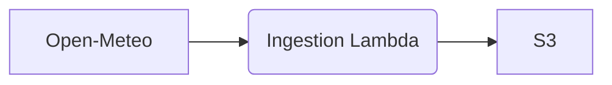
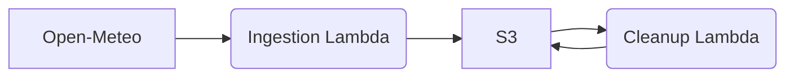

# Vio.com Data Engineer assignment

## Introduction

This assignment is part of the recruitment process of Data Engineers here at Vio.com.
The purpose is to assess the technical skills of our candidates in a generic scenario, similar to the one they would experience at Vio.com.

> **_NOTE_**: Please, read carefully all the instructions before starting to work on your solution and feel free to contact us if you have any questions.

## Repository content

The content of this repository is organised as follows:
- Root directory including:
  - [Dockerfile](Dockerfile) used to build the `client` docker image for the assignment.
  - [docker-compose](docker-compose.yaml) file used to launch the `localstack` and `client` docker containers.
  - [Makefile](Makefile) used in the `client` docker container and that should be used to execute all the necessary steps of the assignment.
  - [zip-lambdas](zip-lambdas.sh) auxiliary script that can be used to zip the code of the AWS Lambda function(s) deployed in the `localstack` docker container. It also takes care of installing and zipping any Python requirement specified in a `requirements.txt` file stored in the same path as the Lambda function code.
- [aws](aws/) directory including a credentials file that allows connecting from the `client` docker container to the `localstack` docker container using the AWS CLI.
- [deployment](deployment/) directory including a sample Terraform script that deploys a S3 bucket and a Lambda function.
- [lambda](lambda/) directory including a `test` Python script for the sample Lambda function.

## Environment

The default configuration in this repository will create two Docker containers:
- `localstack`:
  - Uses the [localstack](https://hub.docker.com/r/localstack/localstack) Docker image
  - [LocalStack](https://docs.localstack.cloud) is a local and limited emulation of AWS, which allows deploying a subset of the AWS resources.
  - It will be used to deploy a simple data infrastructure and run the assignment tasks.
  - This container should be used as is.
- `client`
  - Uses a custom Docker image defined in the [Dockerfile](Dockerfile) and it is based on Ubuntu 20.04.
  - It is used to interact with the `localstack` container.
  - It has some tools pre-installed (Terraform, AWS CLI, Python, etc.).
  - This container and/or its components can (and should) be modified in order to complete the assignment.

The `client` container is configured in the following way:
- All the necessary tools and resources are installed and copied using the [Dockerfile](Dockerfile).
- The entry point of the container is the [Makefile](Makefile).
- The default [Makefile](Makefile) takes care of:
  - Waiting for the `localstack` container to be up and running.
  - Zipping the [lambda](lambda/) function code.
  - Deploying a `test` S3 bucket and a `test` Lambda function defined in the [main.tf](deployment/main.tf) Terraform script.
  - Checking the deployed resources using the AWS CLI.
  - Invoking the Lambda function every 60 seconds using the AWS CLI.

The sample [test](lambda/test/test.py) Lambda function creates a dummy `YYYYMMDDhhmmss.json` object in S3 every time it is invoked.

## Quick start

Follow this steps to get your environment ready for the assignment

1) Fork this repository and clone it in your computer.

2) Install [Docker](https://docs.docker.com/get-docker/).

3) Go to the root folder of the project and execute the following command to create the Docker images and run the containers:

```bash
$ cd data-engineer-assignment
$ docker-compose up
```

4) You will be working with the `client` container. Whenever you change anything, it is recommended to remove the existing container and image to ensure the latest version is used. You can do this with:

```bash
$ docker ps -a

CONTAINER ID   IMAGE                             COMMAND                  CREATED          STATUS        PORTS  NAMES
e30532b91de5   data-engineer-assignment_client   "/bin/sh -c make"        29 minutes ago   Up 8 seconds         client
fc6259295a34   localstack/localstack             "docker-entrypoint.sh"   25 hours ago     Up 9 seconds   ...   localstack

$ docker stop client
$ docker rm client

$ docker image list

REPOSITORY                        TAG         IMAGE ID       CREATED          SIZE
data-engineer-assignment_client   latest      513762759561   32 minutes ago   619MB
localstack/localstack             latest      24d3ad4fc839   4 days ago       1.52GB

$ docker image rm data-engineer-assignment_client
```

5) You can open a SSH session in the `client` container with:

```bash
$ docker exec -it client /bin/bash
```

6) You can also run specific commands. For example, you can use the AWS CLI to list the files in the `test` S3 bucket:

```bash
$ docker exec client aws --endpoint-url=http://localstack:4566 s3 ls test

2022-05-03 15:17:06         31 20220503151706.json
2022-05-03 15:18:08         31 20220503151808.json
```

## Assignment

In this assignment you will be using the [Open-Meteo](https://open-meteo.com/en) Weather Forescat API data.
The overal purpose is to ingest and process some data from the API using the emulated AWS cloud environment of LocalStack.
The assignment is divided in 2 parts, the first one focused on data ingestion and the second one focused on data processing.

>**_NOTE_**: The environment that we provide for the assignment and the examples in it use Terraform to create the infrastructure and Python for the Lambda functions.
However, you are free to choose your own tools for this assignment.
For example, if you feel more comfortable using the AWS CLI to the create the infrastructure or you prefer to use Go in your Lambda functions, that's perfectly fine.
Just remember that, in that case, you may need to install other tools in the `client` docker container and adapt the provided scripts.

### Part 1 - Ingesting weather forecasts into S3

In this first part of the assignment the objective is to ingest data from the Open-Meteo Weather Forecast API.
You should use a Lambda function to query the API and store the results in an S3 bucket.



An example request to get the temperature forecast data for Amsterdam in an hourly basis would be the following:

```bash
$ curl "https://api.open-meteo.com/v1/forecast?latitude=52.370216&longitude=4.895168&hourly=temperature_2m"
````

The response contains the hourly predictions of the selected variables in an array, as shown below (truncated for readability):

```json
{
    "longitude": 4.9,
    "elevation": 1.5683594,
    "hourly": {
        "temperature_2m": [
            6.9,
            6.6,
            6.3
        ],
        "time": [
            "2022-05-04T00:00",
            "2022-05-04T01:00",
            "2022-05-04T02:00"
        ]
    },
    "hourly_units": {
        "temperature_2m": "°C",
        "time": "iso8601"
    },
    "generationtime_ms": 2.3289918899536133,
    "utc_offset_seconds": 0,
    "latitude": 52.38
}
```

You'll need to download the hourly forecast of **temperature at 2m height** and **precipitation** for **3 cities** of your choice.

>**_HINT:_** You can use a service like [this](https://www.latlong.net/) to obtain the latitude and logitude of any city.

The expected file structure in S3 is the following:

```
<my_bucket>
|
|--forecast
    |
    |--<city_name>
    |   |
    |   |-- raw
    |       | 
    |       |- forecast_<YYYYMMDDhhmmss>.json
    |       | 
    |       |- forecast_<YYYYMMDDhhmmss>.json
    |       | 
    |       ...
    |
    |--<city_name>
    |   |
    |   |-- raw
    |       | 
    |       |- forecast_<YYYYMMDDhhmmss>.json
    |       | 
    |       ...
    ...
```

Where <city_name> is the lowercase name of each city, `forecast_<YYYYMMDDhhmmss>.json` is the exact response from the Open-Meteo API and `<YYYYMMDDhhmmss>` is the timestamp when the prediction was retrieved from the API.

>**_NOTE_**: You should keep all files downloaded from the API.

### Part 2 - Processing the weather forecasts

In this part of the assignment you will use the downloaded raw forecasts to create a set of clean objects in S3.
For that, you will create a second Lambda function that will read the raw forecast files and produce the clean ones.



You'll need to process the raw files and create a separate object per hour of prediction
The expected file structure in S3 is the following:

```
<my_bucket>
|
|--forecast
    |
    |--<city_name>
        |
        |-- raw
        |   |
        |   ...
        |
        |-- clean
            |
            |-- date=<YYYYMMDDhh>
            |   | 
            |   |- forecast.json
            |
            |-- date=<YYYYMMDDhh>
            |    |
            |    |- forecast.json
            |
            ...
```

Where `date=<YYYYMMDDhh>` is a prefix for each hour prediction and `forecast.json` is a JSON file with the following format:

```json
{
  "temperature_2m": {
    "unit": "°C",
    "value": 20.5
  },
  "precipitation": {
    "unit": "mm",
    "value": 0.5
  }
}
```

>**_NOTE_**: If you have multiple predictions for a particular hour, you should always keep the one that was generated the latest based on the name of the raw file.

## Evaluation

We expect the solution to be self-contained, as the sample infrastructure provided.
Therefore, we will test your solution by running:

```bash
$ docker-compose up
```

> **_NOTE_**: We suggest using the Makefile to run all the necessary steps in the `client` container, like we do in the sample. However, you are free to do it any way you want, as long as everything that needs to run does so automatically when the containers are launched.

We will then use the AWS CLI in the `client` container to inspect S3 and its contents:

```bash
$ docker exec client aws --endpoint-url=http://localstack:4566 s3 ls <my_bucket>
```

We will also check all the code provided in the repository and evaluate it focusing on:
- Code quality
- Best practices
- Architectural design
- Scalability
- Testing

## References

- [LocalStack docs](https://docs.localstack.cloud/overview/)
- [Terraform docs](https://www.terraform.io/docs)
- [Terraform AWS provider docs](https://registry.terraform.io/providers/hashicorp/aws/latest)
- [AWS CLI docs](https://docs.aws.amazon.com/cli/latest/index.html)
- [AWS Python SDK docs](https://boto3.amazonaws.com/v1/documentation/api/latest/index.html)
- [Open-Meteo Weather Forecast API docs](https://open-meteo.com/en/docs)
- [Latitude and Longitude finder](https://www.latlong.net/)
